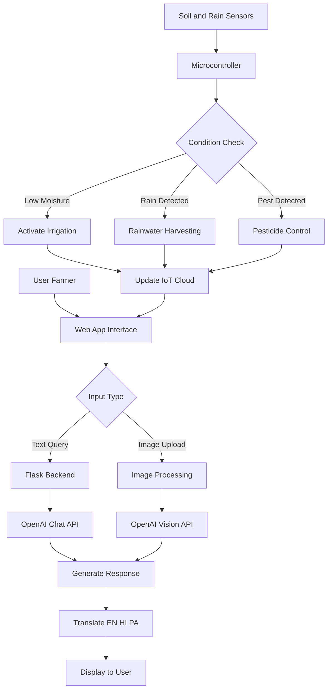
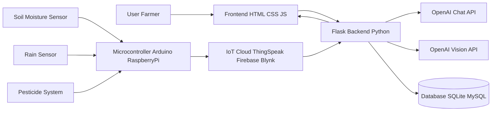

# 🌾 AgriSahayta – Smart Farming Assistant with IOT Monitoring 
-->AgriCSahayta is an integrated AI + IoT smart agriculture system designed to assist farmers in making informed, real-time decisions. The project combines a web-based intelligent chatbot with a hardware-driven agribot ecosystem to address key challenges in modern farming such as irrigation management, crop health monitoring, and resource optimization.

On the software side, the system features an AI-powered chatbot built using Flask and OpenAI APIs. It allows users to ask agriculture-related questions, receive intelligent responses, and interact in multiple languages including English, Hindi, and Punjabi. The chatbot also supports image-based analysis, where farmers can upload crop images and receive insights about possible diseases or conditions using computer vision.

On the hardware side, the agribot integrates various sensors such as soil moisture and rain detection to automate farming processes. Based on real-time environmental data, the system can trigger irrigation, manage pesticide spraying, and support rainwater harvesting. These actions help conserve water, reduce manual effort, and improve crop productivity.

The entire system is connected through an IoT cloud platform, enabling remote monitoring and control. Sensor data is continuously uploaded to the cloud, allowing farmers to track field conditions through a dashboard or interface and make better decisions from anywhere.

By combining AI intelligence with IoT automation, this project demonstrates a scalable and practical approach to smart farming, aiming to improve efficiency, sustainability, and accessibility for modern agriculture.

> AI-powered chatbot for farmers with multilingual support and crop image analysis.

---

## ✨ Features

- 💬 Smart agriculture chatbot with voice support  
- 🔐 User login & registration  
- 👨‍💼 Admin dashboard with Knowledge Base
- 🌐 Supports English, Hindi, Punjabi plus 32 Regional languages   
- 📷 AI crop image analysis  
- 🤖 OpenAI-powered responses
- 🌧️ Rainwater harvesting system integrated with soil sensors
- 💧 Smart irrigation control based on real-time soil moisture data
- 🧪 Pesticide control system for efficient crop protection
- 📡 IoT cloud integration for remote monitoring and control
- 📊 Real-time data tracking and decision making

---


## 🛠️ Tech Stack

**Backend:** Python, Flask  
**Frontend:** Next.JS  
**Database:** SUPABASE 
**AI:** OpenAI API (Chat + Vision) + Random Forest and XGBoost 
**IoT & Hardware:** ESP32, Soil Moisture Sensor, Rain Sensor, Irrigation System, Pesticide Control  
**Cloud:** IoT Cloud (Firebase and Ubidots)  
**Tools:** GitHub, VS Code, Arduino IDE  

---

## 🖼 Screenshots


---

## ⚙️ How It Works

1. User logs in through the web interface  
2. User interacts with the system by:
   - Sending a text query, or  
   - Uploading a crop image  

3. Flask backend processes the request  

4. Based on input:
   - Text queries → processed using OpenAI Chat API  
   - Images → analyzed using OpenAI Vision API  

5. AI generates a response and translates it into the selected language (English, Hindi, Punjabi)  
6. Response is displayed to the user  

7. Meanwhile, IoT sensors (soil moisture, rain, etc.) continuously collect field data  
8. Microcontroller analyzes sensor data and checks conditions  

9. Based on conditions:
   - Low moisture → irrigation system activated  
   - Rain detected → rainwater harvesting triggered  
   - Pest detected → pesticide control system activated  

10. Sensor data is sent to the IoT cloud platform  
11. Cloud updates are reflected in the application/dashboard for remote monitoring


---

## 🔄 Workflow


---
## 🔄 System Architecture

---

##⚙️ Run Locally
git clone https://github.com/yourusername/Agri_Chatbot.git
```python
pip install -r requirements.txt
python app.py
```
👉 Runs on: http://127.0.0.1:5000
---


##🚀 Future Work
- 📱 Mobile app
- 🌱 Better crop detection
- 📊 Analytics dashboard
---

##👨‍💻 Author
- Gurleen Kaur Bedi
  
---

##📜 License

MIT License
